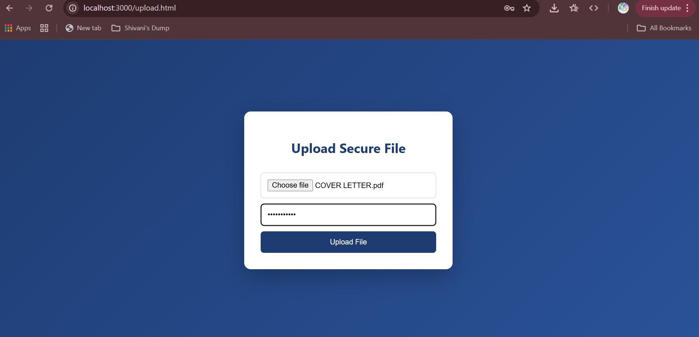

# 🔐 Secure File Sharing System

A full-stack **Node.js** web application that allows users to securely upload files, protect them with passwords, and share controlled download links.

This project demonstrates backend development, authentication, secure file handling, and clean UI design suitable for real-world applications and professional portfolios.

---

## 🚀 Features

- User registration and login system
- Secure password hashing using **bcrypt**
- File upload handling with **Multer**
- Password-protected file downloads
- Unique, shareable download links
- Clean and modern responsive UI
- Lightweight JSON-based data storage

---

## 🛠 Tech Stack

- **Backend:** Node.js, Express.js  
- **Frontend:** HTML, CSS  
- **Security:** bcrypt  
- **File Handling:** multer  
- **Utilities:** uuid  

---

## 📂 Project Structure

secure-file-sharing-nodejs/
│
├── public/                 # Frontend (UI)
│   ├── login.html
│   ├── upload.html
│   ├── download.html
│   └── style.css
│
├── data/                   # Application data (JSON storage)
│   ├── users.json
│   └── files.json
│
├── uploads/                # Uploaded files (runtime)
│   └── (auto-created files)
│
├── Screenshots/             # Screenshots for README
│   ├── login.jpg
│   ├── upload-file.jpg
│   ├── shareable-link.jpg
│   ├── download-page.jpg
│   └── run-localhost.jpg
│
├── server.js               # Main backend server
├── package.json            # Dependencies & scripts
├── package-lock.json
└── README.md               # Project documentation


---

## 🖼 Application Screenshots

### Login & Registration Page


### Upload Secure File


### Shareable Download Link


### Download File with Password


---

## ▶️ Run the Project Locally

### Prerequisites
- Node.js installed on your system

### Steps

```bash
npm install
node server.js


Open your browser and visit:

http://localhost:3000/login.html

🔐 How It Works

Users register or log in securely.

Passwords are hashed before storage.

Authenticated users upload files with a custom password.

A unique shareable download link is generated.

Files can only be downloaded by providing the correct password.

💡 What This Project Demonstrates

Secure backend design principles

Authentication and authorization flow

File handling and access control

RESTful routing with Express.js

Real-world Node.js project structure

🔮 Future Improvements

JWT-based authentication

Database integration (MongoDB)

Cloud storage (AWS S3)

File expiry and access limits

Full deployment with live demo URL

